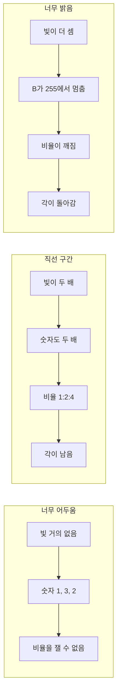
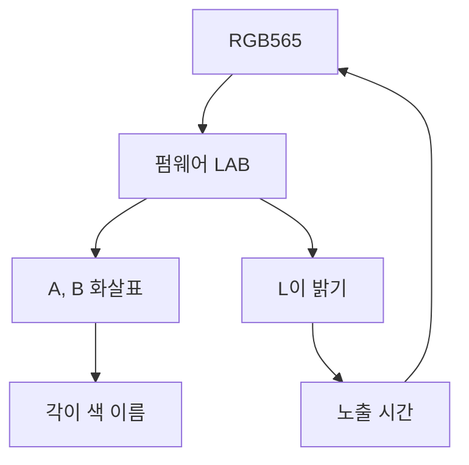

# 직선 구간

센서 숫자와 빛의 관계를 그린 것이다. 가운데만 비스듬한 직선이고, 그 구간에서만 페인트의 각이 남는다.

예시는 파란 페인트다. 비율은 R:G:B = 1:2:4이다. 채널은 0에서 255까지만 센다.

| 빛의 양 | 센서 숫자 | 비율 | 구간 |
| --- | --- | --- | --- |
| 거의 없음 | 1, 3, 2 | 잡음 | 직선 이전 |
| 1 | 10, 20, 40 | 1:2:4 | 직선 구간 |
| 2 | 20, 40, 80 | 1:2:4 | 직선 구간 |
| 8 | 80, 160, 255 | B가 멈춤 | 직선 끝 |

## L과 노출

L은 색 이름이 아니다. 면이 직선 구간에 있는지만 읽고, 노출이 다음 프레임의 RGB를 바꾼다.

판단은 앞에서부터 보고, 먼저 걸린 줄만 실행한다. 면이 없는 화면은 노출을 올리지 않는다. 잘림과 어두움의 정의는 `description.md`와 같다.

| 순서 | 조건 | 노출 |
| --- | --- | --- |
| 1 | 직전 변경 후 다섯 프레임 | 유지 |
| 2 | 잰 덩어리의 L 상위 사분위가 92 이상이고, 어두운 면과 어두운 보라가 없음 | 150 µs 감소 |
| 3 | 보라 중앙값이 36 미만이고, 잘림이 없음 | 300 µs 증가 |
| 4 | 남은 면이 있고, L이 모두 28 이하 | 300 µs 증가 |
| 5 | 잘림과 어두운 면, 또는 잘림과 어두운 보라 | 유지 |
| 6 | 그 밖 | 유지 |

시작은 7500 µs이다. 다섯 프레임을 버린 뒤, 이름으로 남은 면의 L 상위 사분위로 창을 한 번 고른다. 그 값이 92 이상이고 어두운 면과 어두운 보라가 없으면 2500–7500 µs이고, 그 밖은 5000–10000 µs이다. 고른 뒤에는 옮기지 않는다. 게인은 24 dB로 고정되어 있다.
